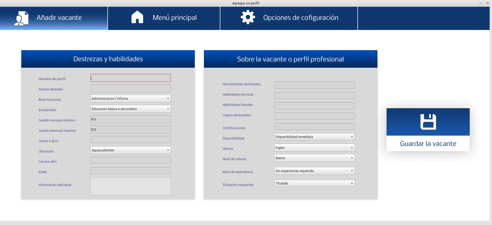

# Sistema de Comparación entre Curriculums Vitae y vacantes profesionales.

Este proyecto es un sistema para poder realizar comparaciones entre curriculums vitae y perfiles profersionales, vacantes o puestos de trabajo. 
Los resultados tras la compración muestran a aquellos candidatos o curriculums que más cercanos están al pefil profesional.
El beneficio más grande, es evitar la revisión manual de muchos, incluso hasta cientos de archivos, quedando únicamente los más parecidos, básandose en los criterios de la vacante.
Por otro lado, el usuario es capaz de poder seleccionar el porcentaje de similitud deseado antes de realizar un proceso de comparación, esto en busca de mejores resultados. 
Dentro de lo más destacado del sistema se tiene que este utiliza una base de datos embebida (no requiere un gestor externo) y por otro lado, hace uso de un modelo de lenguaje 
para poder realizar comparaciones entre los elementos principales del proyecto.

El sistema fue desarrollado primeramente en su versión de consola para después dar paso a la versión con interfaz gráfica.

El proceso de desarrollo se llevó de manera colaborativa.

## Características
- Posibilidad de subir al sistema uno o varios archivos PDF (Curriculums).
- Módulos para poder ingresar o dar de alta las diferentes vacantes, perfiles profesionales o bien puestos de trabajo.
- Posibilidad de actualización y eliminación de los perfiles profesionales que ya han sido de alta en la base de datos.
- Módulo de comparación, donde el usuario puede seleccionar el perfil que desea comparar y el porcentaje que necesita de similitud para considerar aptos a los candidatos.
- Visibilidad de los resultados tras diversos procesos de comparación, donde se permite incluso descargar los curriculums que han pasado la prueba de comparación.
- Opciones de configuración orientadas al correcto manejo de los datos, eficiencia y buen funcionamiento del sistema.

## Tecnologías utilizadas
- **Lenguaje de programación:** Python en su versión 3.12
- **Framework para la interfaz gráfica:** PyQt6, PyQt6-tools, PyQt Designer.
- **Base de datos:** SQLite
- **Librerías destacadas** Sentence transformers y pdfminer.

## Cómo usar

El proyecto está realizado en un etorno virtual, por lo que las librerías vienen en el archivo de requierements.txt

1. Clona este repositorio.
2. Genera tu entorno virtual.
3. Activa el entorno virtual.
4. Actualiza pip.
5. Instala las librerías pertinentes al sistema.
6. Ejecuta menuPrincipal.py
7. Opcional: El sistema viene con datos "dummy", los cuales puedes usar como proceso de experimentación.

## Capturas de pantalla
 
### Interfaz principal

### Modulo de opciones de configuración

### Mostrar todas las vacantes registradas

### Registrar una vacante

### Editar o actualizar una vacante

### Eliminar una vacante

### Comparar curriculums vitae contra una vacante

### Consultar los resultados tras una comparación

